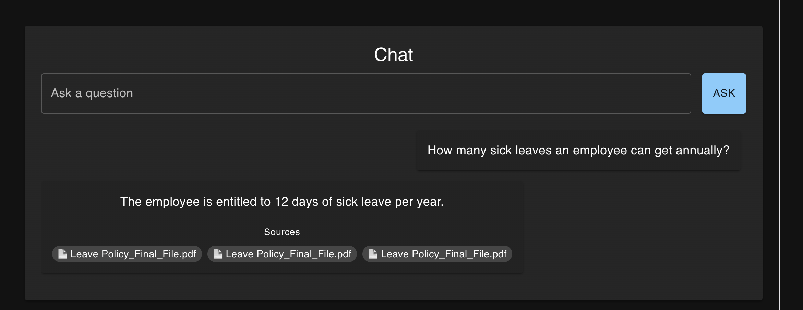

# AI Knowledge Assistant - Backend

An end-to-end Retrieval Augmented Generation (RAG) application that enables users to upload PDF documents and ask natural language questions against their knowledge base.

The application extracts document content, generates embeddings, stores vectors in Qdrant, retrieves relevant context using semantic search, and generates grounded answers using a local LLM running on Ollama.

## Frontend Repository

👉 https://github.com/lavish-chhabra/knowledge-assistant-ui

---

## Features

### Document Ingestion

* Upload PDF documents
* Extract text using Apache PDFBox
* Split documents into configurable chunks
* Generate embeddings using Ollama embedding models
* Store vectors in Qdrant
* Persist document metadata in PostgreSQL

### Semantic Search

* Convert user questions into embeddings
* Perform vector similarity search in Qdrant
* Retrieve relevant document chunks
* Build contextual prompts dynamically

### AI-Powered Question Answering

* Local LLM inference using Ollama
* Retrieval Augmented Generation (RAG)
* Source-aware responses
* Hallucination reduction through contextual grounding

### User Interface

* React-based frontend
* Document upload interface
* Chat-style question answering
* Source citations
* Dark mode support
* Chat history
* Auto-scrolling conversation window

### Infrastructure

* Dockerized deployment
* PostgreSQL for metadata storage
* Qdrant vector database
* Spring Boot backend
* React frontend

---

## Screenshots

### Upload Document


### Chat Interface



---

## Architecture

```text
                        +-------------------+
                        |      React UI     |
                        +---------+---------+
                                  |
                                  v
                        +-------------------+
                        |   Spring Boot API |
                        +---------+---------+
                                  |
               +------------------+------------------+
               |                                     |
               v                                     v

      +-------------------+               +-------------------+
      |     PostgreSQL    |               |      Qdrant       |
      | Document Metadata |               | Vector Database   |
      +-------------------+               +-------------------+
                                                    |
                                                    v
                                          +-------------------+
                                          |      Ollama       |
                                          | Embeddings + LLM  |
                                          +-------------------+
```

---

## Document Upload Flow

```text
PDF Upload
     |
     v
Extract Text (PDFBox)
     |
     v
Chunk Text
     |
     v
Generate Embeddings
     |
     v
Store Embeddings in Qdrant
     |
     v
Store Metadata in PostgreSQL
```

---

## Question Answering Flow

```text
User Question
      |
      v
Generate Question Embedding
      |
      v
Vector Search in Qdrant
      |
      v
Retrieve Relevant Chunks
      |
      v
Build Prompt
      |
      v
Send Context + Question to LLM
      |
      v
Generate Grounded Answer
      |
      v
Return Answer + Sources
```

---

## Technology Stack

### Backend

* Java 21
* Spring Boot 3
* Spring Data JPA
* Maven

### AI / RAG

* LangChain4j
* Ollama
* Qdrant
* Vector Embeddings
* Retrieval Augmented Generation (RAG)

### Database

* PostgreSQL

### Frontend

* React
* Material UI
* Axios

### Document Processing

* Apache PDFBox

### Infrastructure

* Docker
* Docker Compose

---

## Project Structure

```text
knowledge-assistant
│
├── src/main/java
│   ├── controller
│   ├── service
│   ├── repository
│   ├── entity
│   ├── dto
│   └── config
│
├── src/main/resources
│   ├── prompts
│   └── application.properties
│
├── Dockerfile
├── docker-compose.yml
└── pom.xml
```

---

## Running Locally

### Prerequisites

* Java 21
* Maven
* Docker
* Ollama

### Pull Models

```bash
ollama pull qwen3

ollama pull nomic-embed-text
```

### Start Infrastructure

```bash
docker compose up -d
```

### Start Backend

```bash
mvn spring-boot:run
```

### Start Frontend

```bash
npm install

npm run dev
```

---

## Docker Deployment

Build application:

```bash
mvn clean package
```

Start services:

```bash
docker compose up --build
```

Services:

* Spring Boot API → localhost:8080
* PostgreSQL → localhost:5432
* Qdrant → localhost:6333
* React UI → localhost:5173

---

## Future Enhancements

* JWT Authentication
* Multi-user document isolation
* Streaming LLM responses
* Hybrid Search (Keyword + Vector Search)
* Reranking
* Observability and Metrics
* Cloud Deployment
* Role-Based Access Control

---

## Key Learnings

This project demonstrates:

* End-to-end RAG implementation
* Vector databases and embeddings
* Semantic search
* LLM integration
* Spring Boot microservice development
* React frontend development
* Docker containerization
* Production-oriented architecture

---

## Author

Lavish Chhabra

Java Backend Engineer | AI Engineering Enthusiast

Building intelligent applications using Java, Spring Boot, LLMs, RAG, Cloud and Distributed Systems.
